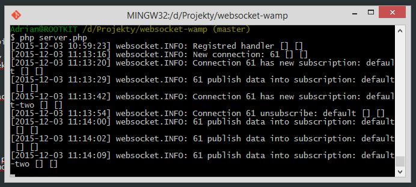
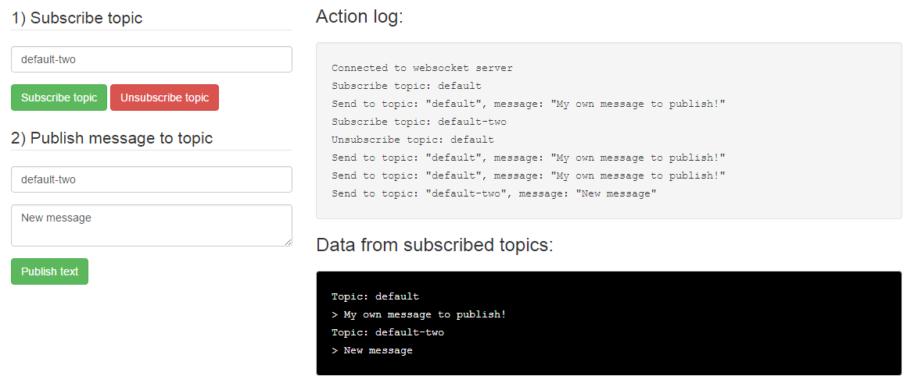

# Websocket WAMP - Client & Server

Implementacja komunikacji z wykorzystaniem subprotokołu WAMP.

- [WAMP - Web Application Messaging Protocol](http://wamp.ws)
- [AutobahnJS - client side lib](https://github.com/oberstet/AutobahnJS)
- [Ratchet - server side lib](https://github.com/ratchetphp/Ratchet/)

## WAMP - WebSocket Application Messaging Protocol

- subprotokół ułatwiający komunikację z wykorzystaniem *websockets*
- niezależny od technologii - dostępne są lepszej i gorszej jakości implementacje dla najpopularniejszych języków programowania

### [RPC - Remote Procedure Call](https://en.wikipedia.org/wiki/Remote_procedure_call)

- zdalne wywołanie procedury
  - klient wysyła do serwera żądanie wykonanie procedury np. *addTwoInt(1, 4)*
  - serwer odpowiada wynikiem np. *5*
- parametry wykonywanej procedury oraz jej wynik może być typem: *array*, *mapping*, *number*, *string*

### [Publish-subscribe pattern](https://en.wikipedia.org/wiki/Publish%E2%80%93subscribe_pattern)

- klient może subskrybować dany *topic*
- klient może publikować dane na wybrany *topic*
- wszyscy klienci którzy subskrybują *topic* otrzymują dane które zostały w nim opublikowane

## Jak to działa?

Przykład wykorzystuje *Publish-subscribe pattern*.

### Serwer

- serwer pośredniczący w komunikacji do którego podłaczają się klienci
- loguje wszystkie informacje na *stdout*
- propaguje rozesłanie wiadomości która została opublikowana na danym *topic* do wszystkich jego subskrybentów
- w przykładzie wykorzystano *PHP* oraz bibliotekę *Rachet*

### Klient

- nawiązuje połączenie z serwerem
- umożliwia subskrybcję *topic*
- umożliwia publikowanie danych na wybrany *topic*
- loguje wszystkie wykonywane akcje
- loguje wszystkie odebrane dane, które zostały opublikowane na subskrybowanych *topic*
- wykorzystano język *JavaScript* oraz bibliotekę *AutobahnJS*

## Uruchomienie

Uruchomienie serwera pośredniczącego w komunikacji pomiędzy klientami:

```bash
$: cd path/to/project
$: composer install
$: php server.php
```

Uruchomienie klienta wymaga jedynie otworzenia pliku *client-example.html* za pomocą dowolnej przeglądarki internetowej.
Dla lepszego zobrazowania działania warto uruchomić go w kilku kopiach (każda kopia = jeden klient).

## Screens

## Serwer



### Klient 

